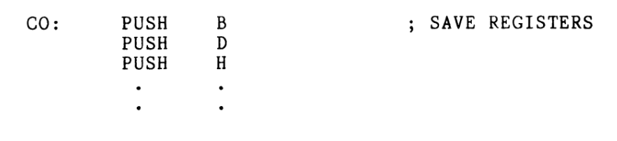
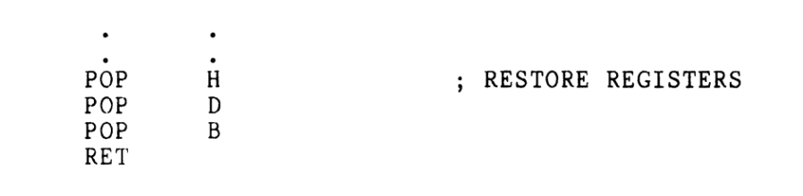
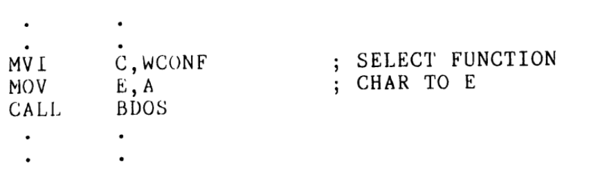

# Chapter 10

- There needs to be User environment is separate from the operating system
- using subrouteins help keep the users registers clean
- This separation improves program reliability and portability.

## Making User Stack

- The stack stores temporary data and return addresses it grows downward in memory.
- You need to choose the top of the stack and how big it is.
- “DS” means define storage which you use to set stack size.
- “DB” means Define Byte which you use to set the first byte.

DS 64 ;

STAK: DB 0 ;

Then we have to set the pointer to the top of the stack using 

START: LXI SP,STAK ; SET UP STACK POINTER

## Saving the User’s Register Contents

- We want to preserve the contents of all hardware registers every time CP/M is called upon for I/O services
- Becauses loaded the accumulator with data to be passed to the system, our program must know what the data was, so saving the contents of A is not necessary
- This I/O subroutine is used to save the contents of the registers on the stack

- Upon return from BDOS we will restore the registers with this subroutine

- The last in (H) must be the first out
 
## Calling BDOS
- This example from the Introduction has now become a usable subroutine that provides the desired interfacing between the user's register requirements and the operating system.

1. Select the function (WCONF - Write character to console device)
2. Move the character from A to E
3. Call BDOS to execute

## Return to CP/M
- Using similar subroutines for all system interfacing provides a method for easily adapting our programs to other operating system
- The safe way to terminate every program is with a JMP 0 instruction, so the operating system will be rebooted
